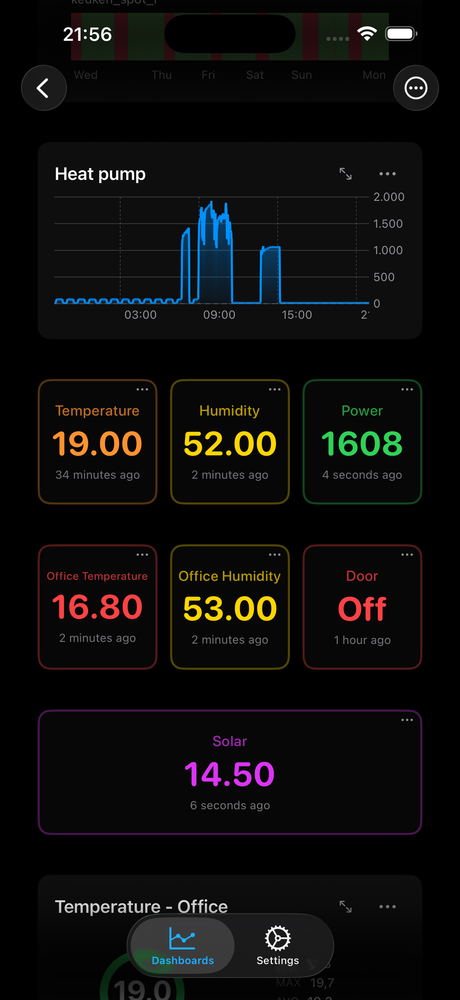

# Quatt CIC to InfluxDB Bridge


Your Quatt heat pump already collects detailed telemetry — compressor power, flow temperatures, boiler status, COP metrics — but it's locked inside a local JSON API with no built-in way to track trends, set alerts, or correlate with your solar production and energy usage.

This bridge **unlocks that data** by streaming it into **InfluxDB**, the industry-standard time-series database. Once it's there, the possibilities open up:

- **Build dashboards** in Grafana to monitor your heat pump's performance in real time
- **Track efficiency over time** — spot COP degradation, compare heating seasons, or correlate with outdoor temperature
- **Set up alerts** — get notified when flow temperatures drop unexpectedly or the boiler kicks in too often
- **Combine with other data** — overlay solar production, electricity prices, or indoor climate sensors for a complete energy picture
- **Query with SQL** — run ad-hoc analysis directly on your data, no vendor lock-in

Works with **InfluxDB v2** and **v3**. Ships as a single Python script with a **one-command Proxmox VE installer** that creates a dedicated, minimal LXC container.

<a href="https://influxdb-dashboard.netlify.app/">
  
</a>

<sub>This is how I monitor my own setup — built with the <a href="https://influxdb-dashboard.netlify.app/">InfluxDB Dashboard app</a></sub>

---

## Why This Bridge?

Quatt heat pumps expose a local JSON API on the CIC, but the data isn't easy to graph, alert on, or correlate with other home-energy metrics out of the box. This bridge closes that gap:

- **No cloud dependency** — everything stays on your local network
- **No manual field mapping** — the bridge auto-discovers every data section the CIC exposes and flattens nested JSON into InfluxDB measurements automatically
- **Instant time-series** — data lands in InfluxDB with nanosecond precision, ready for Grafana dashboards, SQL queries, or alerting rules
- **Set and forget** — runs as a systemd service with automatic recovery, in a lightweight LXC container that uses just 128 MB RAM

---

## Features

- **Automatic discovery** of all CIC data sections — no manual field mapping required
- **InfluxDB v2 + v3** support with automatic bucket/database creation
- **One-liner Proxmox installer** — creates an LXC, configures networking, installs dependencies, and starts the service
- **Tiny footprint** — runs in 128 MB RAM / 2 GB disk / 1 CPU core
- **Runs as a systemd service** with automatic restart on failure
- **Configurable poll interval** (default: 10 seconds)
- **Line protocol output** — nested JSON is flattened into InfluxDB-native measurements, one per CIC section (`quatt_hp1`, `quatt_hp2`, `quatt_boiler`, etc.)

## Architecture

```
Quatt CIC                          InfluxDB
(heat pump)                        (v2 or v3)
    |                                  ^
    |  GET /beta/feed/data.json        |  POST line protocol
    v                                  |
 ┌──────────────────────────────────────┐
 │         quatt-influxdb-bridge        │
 │     (LXC container on Proxmox)      │
 └──────────────────────────────────────┘
```

The bridge polls the CIC's local JSON API, flattens the nested response into InfluxDB line protocol, and writes each section as a separate measurement with nanosecond-precision timestamps from the CIC clock.

## Quick Start (Proxmox VE)

Run this **on the Proxmox host** — the script will walk you through all configuration interactively:

```bash
bash -c "$(curl -fsSL https://raw.githubusercontent.com/antongitnow/quatt-influxdb-bridge/main/ct/quatt-bridge.sh)"
```

You will be prompted for:

| Parameter | Description | Default |
|---|---|---|
| CIC IP | Local IP of your Quatt heat pump | — |
| InfluxDB IP | IP of your InfluxDB instance | — |
| InfluxDB port | InfluxDB HTTP port | `8086` |
| InfluxDB version | `2` or `3` | `3` |
| Organisation | InfluxDB v2 org name (v2 only) | — |
| Bucket / Database | Name of the bucket (v2) or database (v3) | `quatt` |
| API token | InfluxDB authentication token | — |
| Poll interval | Seconds between data fetches | `10` |

The installer creates an unprivileged Ubuntu 22.04 LXC container, writes a secure config file, installs the bridge, and starts it.

## Manual Install

If you're not using Proxmox, install on any Linux or macOS machine with Python 3.10+:

```bash
git clone https://github.com/antongitnow/quatt-influxdb-bridge.git
cd quatt-influxdb-bridge

python3 -m venv venv
source venv/bin/activate
pip install -r requirements.txt
```

Create a config file or export the environment variables:

```bash
export CIC_IP="192.168.1.100"
export INFLUXDB_IP="192.168.1.152"
export INFLUXDB_TOKEN="your-token-here"
export INFLUXDB_VERSION="2"        # "2" or "3"
export INFLUXDB_ORG="my-org"       # required for v2
export INFLUXDB_DB="quatt"         # bucket (v2) or database (v3)
export POLL_INTERVAL="10"

python bridge.py
```

## Configuration Reference

All configuration is done via environment variables. When using the Proxmox installer these are stored in `/etc/quatt-bridge/config.env`.

| Variable | Required | Default | Description |
|---|---|---|---|
| `CIC_IP` | Yes | — | IP address of the Quatt CIC |
| `INFLUXDB_IP` | Yes | — | IP address of your InfluxDB instance |
| `INFLUXDB_TOKEN` | Yes | — | API token for authentication |
| `INFLUXDB_VERSION` | No | `3` | `2` for InfluxDB v2, `3` for v3 |
| `INFLUXDB_PORT` | No | `8086` | InfluxDB HTTP port |
| `INFLUXDB_ORG` | v2 only | — | Organisation name or hex ID (v2 only) |
| `INFLUXDB_DB` | No | `quatt` | Bucket name (v2) or database name (v3) |
| `POLL_INTERVAL` | No | `10` | Seconds between polls |

## Measurements

The bridge creates one measurement per CIC section. Common measurements include:

| Measurement | Description |
|---|---|
| `quatt_hp1` | Heat pump 1 operating data |
| `quatt_hp2` | Heat pump 2 operating data (if present) |
| `quatt_boiler` | Boiler status and temperatures |
| `quatt_thermostat` | Thermostat setpoints and room temperatures |
| `quatt_flowMeter` | Flow rates and energy counters |
| `quatt_system` | System-level status |

All numeric values are stored as InfluxDB fields. String identifiers like `hostName` are promoted to tags for efficient grouping.

## Example Grafana Query

```sql
SELECT mean("temperatureOutside") FROM "quatt_hp1"
WHERE time > now() - 24h
GROUP BY time(5m) fill(null)
```

## Managing the Service

```bash
# View live logs
journalctl -u quatt-bridge -f

# Check status
systemctl status quatt-bridge

# Restart after config change
systemctl restart quatt-bridge

# Stop the bridge
systemctl stop quatt-bridge
```

From the Proxmox host:

```bash
pct exec <CTID> -- journalctl -u quatt-bridge -f
```

## Contributing

Contributions are welcome! Feel free to open an issue or submit a pull request.

Some ideas for contributions:

- Support for MQTT output
- Grafana dashboard JSON export
- Home Assistant integration
- Docker / Docker Compose setup
- Configurable measurement naming

## Related Projects

- [Quatt](https://www.quatt.io/) — the hybrid heat pump this bridge is built for
- [InfluxDB](https://www.influxdata.com/) — time-series database for metrics and telemetry
- [Grafana](https://grafana.com/) — dashboarding and alerting for InfluxDB data
- [community-scripts/ProxmoxVE](https://github.com/community-scripts/ProxmoxVE) — LXC helper script inspiration
- [Tweakers Quatt topic](https://gathering.tweakers.net/forum/list_messages/2088656) — active Dutch community discussion on Quatt heat pumps

## License

MIT
